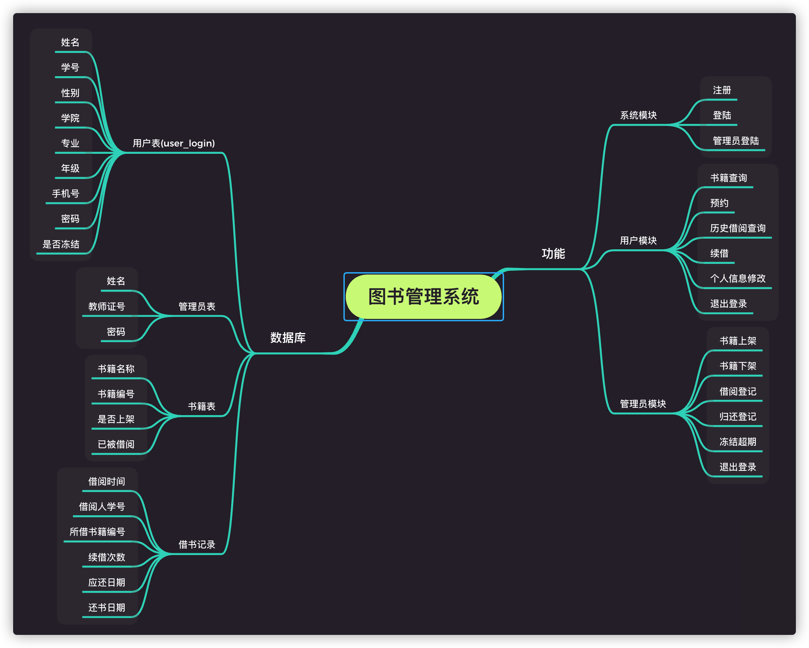

# Database
数据结构大作业

## 图书馆管理系统
### 概述
图书馆的管理包括人员与书籍的管理，以学校图书馆为例，则有学生信息管理，书籍借阅管理，书籍上架、下架，超期处罚等

### 基本功能模块

- 系统模块：学生注册、学生登陆、管理员登陆
- 用户模块：书籍査询、预约、历史借阅査询、续借、个人信息修改、退出登录。
- 管理员模块：书籍上架、下架、借阅登记、归还登记、冻结超期用户、退出登录

## 结构

